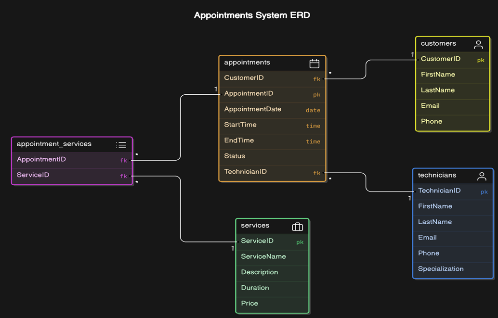
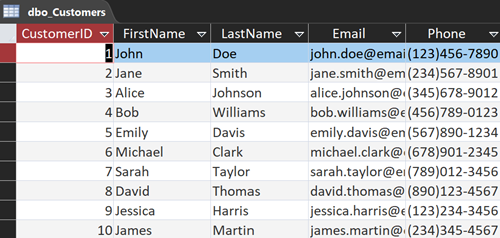
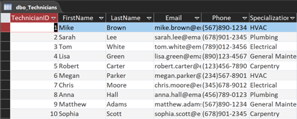
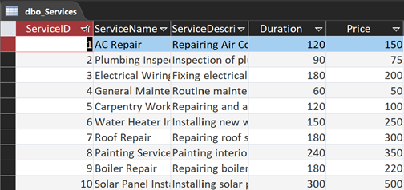
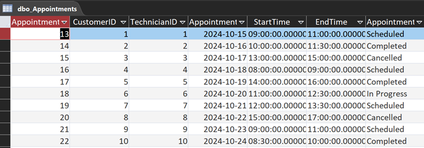

# Service Appointment System Database

To simplify and automate the service appointment process for an appliance repair business, a comprehensive software programme called the Service Appointment database was created. For effective data management and archiving, the database makes use of both Microsoft Access and SQL Server Management Studio (SSMS).

## Core Tables

The database consists of five core tables:

1. **Customers**: Stores information about clients requesting services.
   

      
   

2. **Technicians**: Contains details about service providers.
   

      
   

3. **Services**: Holds all services offered by the company.
   

      
   

4. **Appointments**: Central table connecting customers, technicians, and services.
   

      
   

5. **AppointmentServices**: Junction table creating a many-to-many relationship between Appointments and Services.
   
## Relationships Between Entities

### Customers and Appointments (One-to-Many)
One customer can have many appointments, but each appointment is associated with only one customer.

### Technicians and Appointments (One-to-Many)
One technician can have many appointments, but each appointment is assigned to only one technician.

### Appointments and Services (Many-to-Many)
An appointment can include multiple services, and a service can be part of multiple appointments.

## Application Functionality

1. **Service Management**: Facilitates management of service calls by collecting and maintaining relevant information.
2. **Employee Management**: Enables management of technician data and assignments to service orders.
3. **Customer Relationship Management**: Maintains an updated database of customer information for personalized interactions and efficient communication.

The Service Appointment System database offers a robust and convenient framework for controlling the appliance repair service process by utilizing both SSMS and Access. This implementation streamlines operations, increases client satisfaction, and improves the overall performance of the company.

[Link to User Information](UserInformation.md)