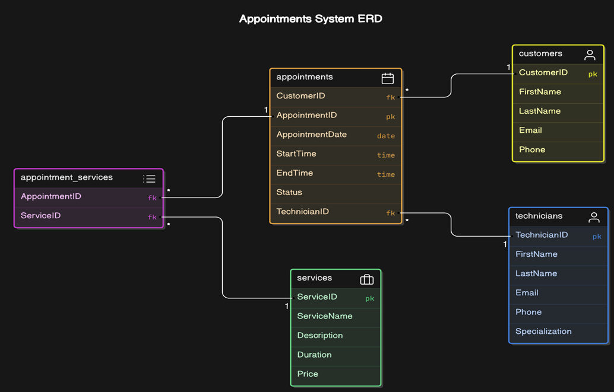

# README

Welcome to the Service Appointment System!

This repository contains documentation and instructions for using the Service Appointment System, which includes both backend and frontend components.

## Documentation

1. [Service Appointment System Database](./ApplicationDescription.md)
   - This document provides an overview of the database structure, core tables, relationships, and application functionality.

2. [User Instructions](./UserInformation.md)
   - This document outlines how to use the application interface, including instructions for managing customer data and navigating forms.

3. [Backup and Restoration](./InstallationBackup.md)

## Getting Started

To get started, please refer to the above documents for detailed information on the system's architecture and user instructions.

For any questions or issues, feel free to reach out!
