# User Instructions

## Interface Overview

The system uses both SQL Server Management Studio (SSMS) and Microsoft Access.

### Using SSMS:

SSMS is the backend part of the system, where databases and tables are created. Please refer to the installation and backup file for more information. The tables are created using SQL statements, and for the user interface, MS Access is used with its user-friendly features such as forms, reports, etc.

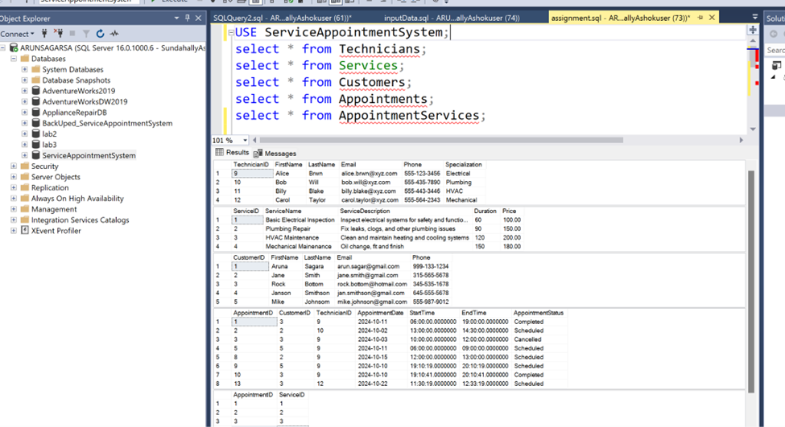

### Using MS Access:

MS Access acts as the frontend of the application. Once the connection has been made to the SQL server backend, the user needs to connect via login credentials as shown below.

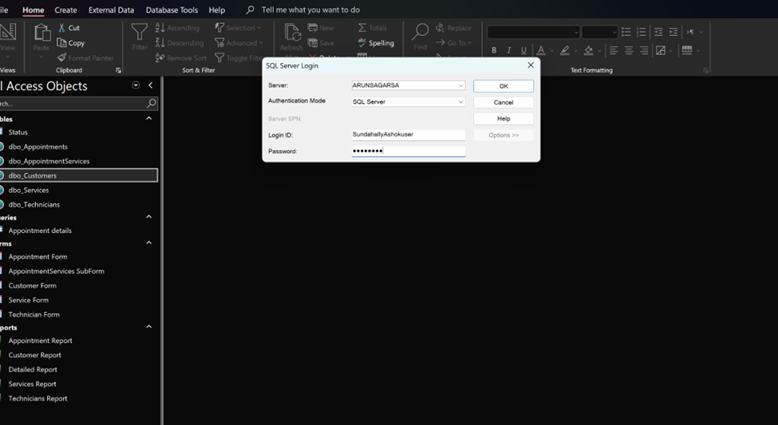

After this connection, the user will be able to access all the database objects to make any changes.

MS Access has various objects such as tables, queries, reports, and forms.

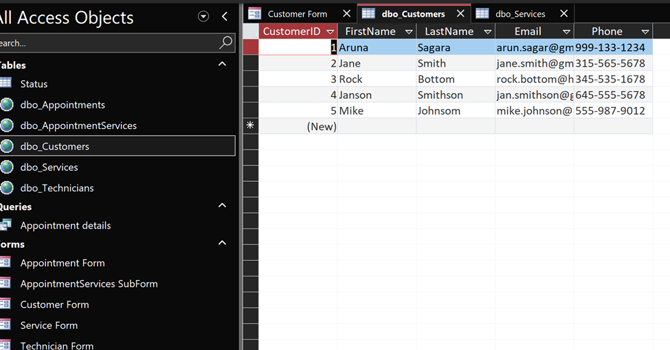

## Customer Management Form

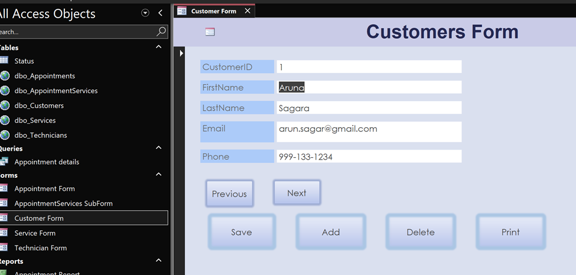

The above form allows you to manage customer data, including adding new customers, deleting customers, and saving customer information. Below are the instructions for using these features of the form. Similar steps can be used for other forms.

### Form Fields:
- **CustomerID**: Displays the ID of the customer. This is automatically generated and cannot be changed manually.
- **FirstName**: Input the customer's first name here.
- **LastName**: Input the customer's last name here.
- **Email**: Input the customer's email address here.
- **Phone**: Input the customer's phone number in the format XXX-XXX-XXXX.

### Buttons and Actions:

1. **Add**:
   - Use this button to add a new customer to the database.
   - Fill in the required fields (FirstName, LastName, Email, and Phone) before clicking this button.
   - After clicking, the system will save the new customer and assign a unique CustomerID.

2. **Delete**:
   - To delete an existing customer, click Delete Customer to remove them from the database.

3. **Save**:
   - After adding or updating customer information, click Save to ensure that the changes are stored in the database.
   - Always click Save after making changes to avoid losing any new data.

4. **Print**:
   - Use the Print button to print the current customer's information in the form.
   - The printout will include all fields such as FirstName, LastName, Email, and Phone.

5. **Navigation**:
   - Click prev and next to navigate the form 

## Additional Screenshots

### 1. Application Form
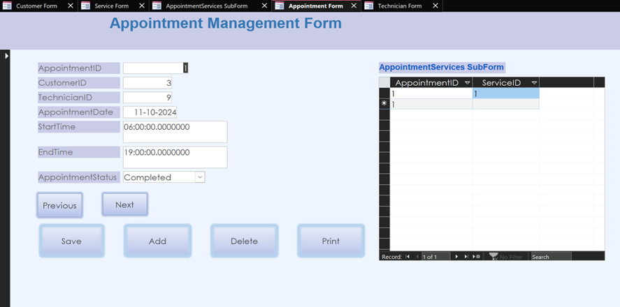

### 2. Technician Form
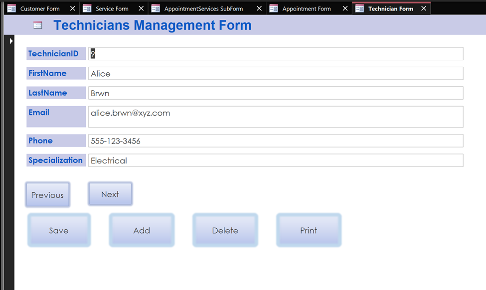

### 3. Service Form
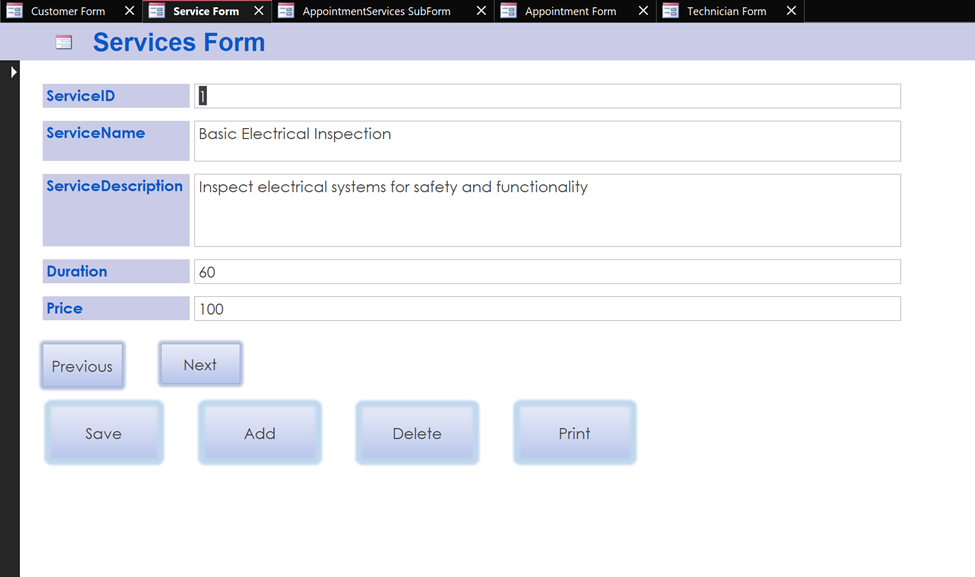

## Reports

### 1. Application Report
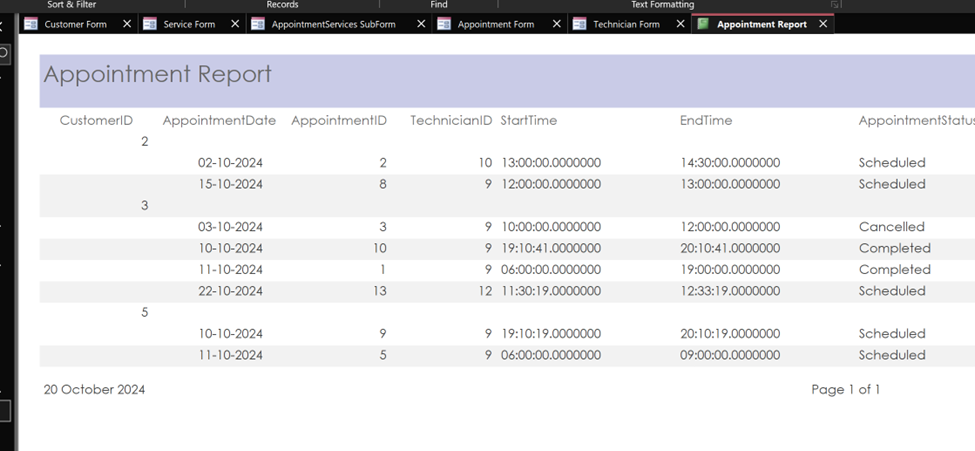

### 2. Customer Report
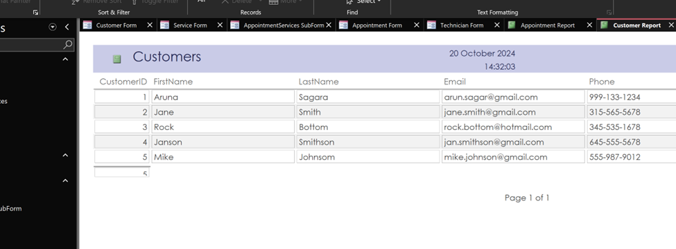

### 3. Detailed Report (using query)
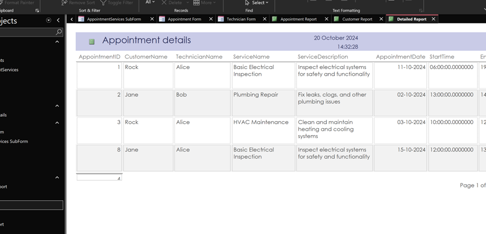

### 4. Technicians Report
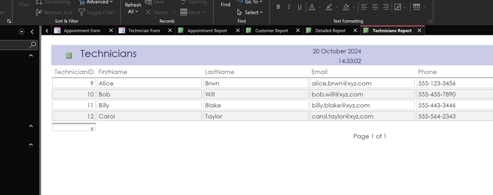