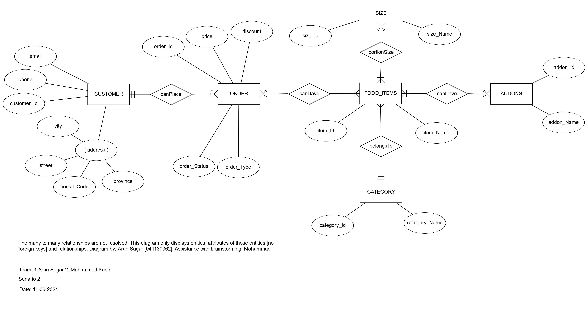
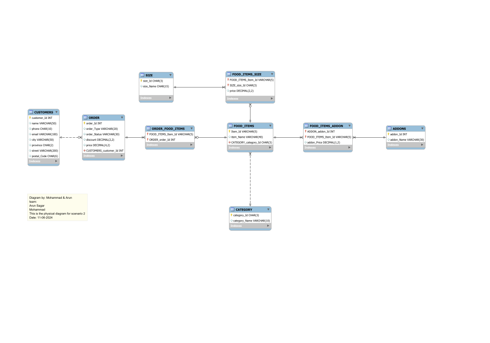

# Pizza Shop Ordering System

## Description

The Pizza Shop Ordering System is a comprehensive database solution designed to manage customer orders for a pizza shop that offers a variety of food items across different categories. This system allows for efficient tracking of customer orders, menu items, and customizations.

Key features include:
- Customer management
- Order processing
- Menu item categorization
- Size and add-on options for food items
- Flexible pricing based on item size and add-ons

The system is built on a robust entity-relationship model that captures the complexities of a real-world pizza shop operation, including the ability to handle multiple food categories, customizable orders, and detailed pricing structures.

## Overview

This project implements a database system for managing orders in a pizza shop. It's designed to handle various aspects of the ordering process, from customer information to detailed food item specifications.

## Entity Relationship Diagram

The system is based on a carefully designed ERD that includes the following main entities:
- CUSTOMER
- ORDER
- FOOD_ITEM
- CATEGORY
- SIZE
- ADDONS

## Key Features

- **Customer Management**: Track customer details and order history
- **Order Processing**: Handle multiple items per order with customizations
- **Menu Flexibility**: Support for various food categories, not limited to pizza
- **Customization Options**: Size selections and add-ons for applicable items
- **Dynamic Pricing**: Price calculation based on item size and selected add-ons

## Business Rules

- Customers can place multiple orders or no orders
- Each order is associated with one customer
- Orders must contain at least one food item
- Food items belong to a single category
- Sizes and add-ons are optional and depend on the food item

## Assumptions

- Single menu system
- One phone number per customer
- Add-ons are not category-specific
- Pricing is dynamically calculated based on size and add-ons

## Database Schema

The physical database schema includes tables for all main entities with appropriate data types and constraints. Relationships are properly resolved, including the handling of many-to-many relationships.

## Implementation

The system is implemented using MySQL, with the physical diagram created in MySQL Workbench.

## Future Enhancements

- Order status tracking
- Integration with a front-end ordering system
- Reporting and analytics features

## Screenshots

- ERD
 

- MySQL Workbench genrated Model
